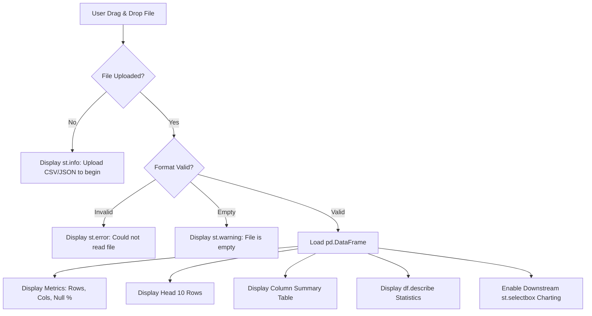

# Interactive Data Upload & Automated Dataset Preview Architecture Guide

## 1. Streamlit File Uploader Buffer Mechanics

When a user drags and drops a file into Streamlit's `st.file_uploader` component:
1. **Browser Buffer Transfer:** The browser sends the raw file payload as a binary buffer stream (`UploadedFile` object inheriting from `io.BytesIO`).
2. **Format Recognition:** Streamlit identifies the file extension (`.csv` or `.json`).
3. **Pandas Ingestion:** 
   - For CSV files: `pd.read_csv(uploaded_file)` reads the byte stream directly into a tabular DataFrame.
   - For JSON files: `pd.read_json(uploaded_file)` parses JSON arrays/records into columns.
4. **Session Availability:** The resulting `df` DataFrame exists within memory during the active script rerun, allowing immediate downstream filtering and charting without disc I/O.

---

## 2. Null Percentage Calculation Logic

To evaluate overall dataset completeness:
- **Total Cell Count:** \(\text{Rows} \times \text{Columns}\) (`df.shape[0] * df.shape[1]`).
- **Overall Null Percentage:**
  $$\text{Null \%} = \frac{\sum \text{isnull()}}{\text{Total Cells}} \times 100$$
- **Per-Column Null Percentage:**
  $$\text{Column Null \%} = \frac{\text{Column.isnull().sum()}}{\text{len(df)}} \times 100$$

---

## 3. Upload-to-Preview Workflow & Error Handling



---

## 4. Answer to Follow-Up Question: Multi-File Upload & Automated Merging

### Question:
*How would you extend this system to support uploading multiple CSV/JSON files simultaneously and merging them automatically?*

### Technical Implementation:

To support multi-file uploads in Streamlit, set `accept_multiple_files=True` in `st.file_uploader`.

```python
import streamlit as st
import pandas as pd

uploaded_files = st.file_uploader(
    "Upload multiple CSV or JSON files",
    type=["csv", "json"],
    accept_multiple_files=True
)

if uploaded_files:
    df_list = []
    
    for file in uploaded_files:
        try:
            if file.name.endswith(".csv"):
                temp_df = pd.read_csv(file)
            elif file.name.endswith(".json"):
                temp_df = pd.read_json(file)
            
            if not temp_df.empty:
                temp_df['_source_file'] = file.name  # Track provenance
                df_list.append(temp_df)
        except Exception as e:
            st.error(f"Error loading {file.name}: {e}")

    if df_list:
        # Option A: Stack rows vertically if schema matches (Concatenation)
        merged_df = pd.concat(df_list, ignore_index=True)
        st.success(f"Successfully merged {len(uploaded_files)} files into {len(merged_df):,} total rows!")
        st.dataframe(merged_df.head(10), use_container_width=True)
```
